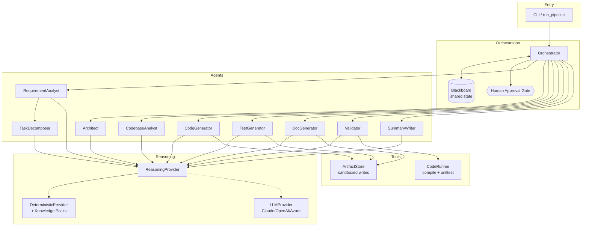
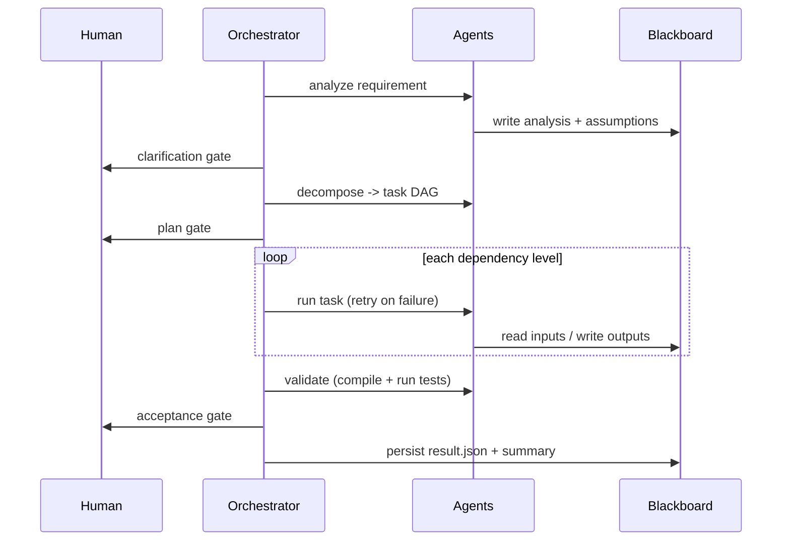

# Architecture Overview

## 1. Purpose

The Agentic SDLC system transforms a natural-language software requirement into a
**reviewable engineering outcome**: a normalized problem statement, a dependency-aware
plan, generated code + API contract + tests + docs, a validation report, and a final
engineering summary — produced under **controlled autonomy** (agents act, humans approve).

## 2. Component model



## 3. Execution model & control flow

The orchestrator runs three phases:

1. **Bootstrap** — `RequirementAnalyst` normalizes the requirement and records an
   explicit assumption for every ambiguity. A **clarification gate** lets a human review.
2. **Plan** — `TaskDecomposer` produces a DAG; a **plan gate** approves it. The DAG is
   grouped into *dependency levels* via topological sort, so independent work
   (e.g. `code` and `docs`) sits in the same level and could run concurrently.
3. **Execute & Accept** — the orchestrator walks the levels, dispatching each task to the
   agent registered for its `category`. Every task is wrapped in **retry-with-backoff**;
   a persistent failure **degrades** optional tasks (docs, impact) or **halts** on required
   ones. A final **acceptance gate** reviews the validation report.



## 4. The DAG (mandatory URL-shortener example)

```
design ──┬─► code ──► tests ──┐
         │                    ├─► validate ──► summary
         └─► docs ────────────┘
```

Brownfield requirements inject an `impact` task that `code` depends on:

```
design, impact ──► code ──► tests ──┐
                    docs ───────────┴─► validate ──► summary
```

## 5. Key technical decisions

| Decision | Rationale |
| --- | --- |
| **Perceive → decide → act agents** | Each agent observes state, chooses an action, and records *why* — the property that makes them agents, not functions; decisions are auditable. |
| **Validation feedback loop** | Repairable findings flow *back* into generation (bounded), so recovery is agent-driven self-correction, not linear retry. |
| **Blackboard coordination** | Agents never call each other; all state flows through one inspectable object, making runs auditable and agents independently testable. |
| **Provider seam** | A small typed interface (`ReasoningProvider`) lets the same agents run offline (deterministic) or on a live LLM without changing orchestration. |
| **Deterministic default** | Zero dependencies / API keys → reproducible, gradable runs; the mandatory use case produces identical, reviewable output every time. |
| **Knowledge packs** | Domain expertise is isolated and pluggable; adding a domain is a new pack, not an orchestrator change. |
| **DAG by dependency level** | Demonstrates real sequencing + potential parallelism, not linear execution. |
| **Retry / degrade / halt** | Concrete error handling and recovery with a clear required-vs-optional policy. |
| **Validator runs the tests** | Outputs are *verified* (compiled + executed), not merely produced. |
| **Sandboxed artifact writes** | Path-traversal guard is a real guardrail for safe execution. |
| **HITL gates** | Controlled autonomy: agents act; humans approve at defined checkpoints. |

## 6. Extension points

- **New domain:** add a `KnowledgePack` and register it in `DeterministicProvider._PACKS`.
- **New capability/agent:** add an `Agent` and one entry in `agents.DAG_AGENTS`; add a task
  to the decomposer with the matching `category`.
- **Live model:** set `--provider claude` (or `openai`); the model drives analysis,
  decomposition, and design, with per-stage deterministic fallback and usage metrics.
