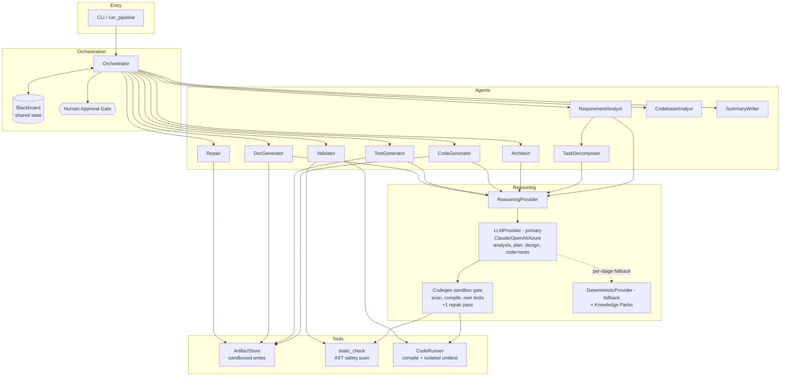
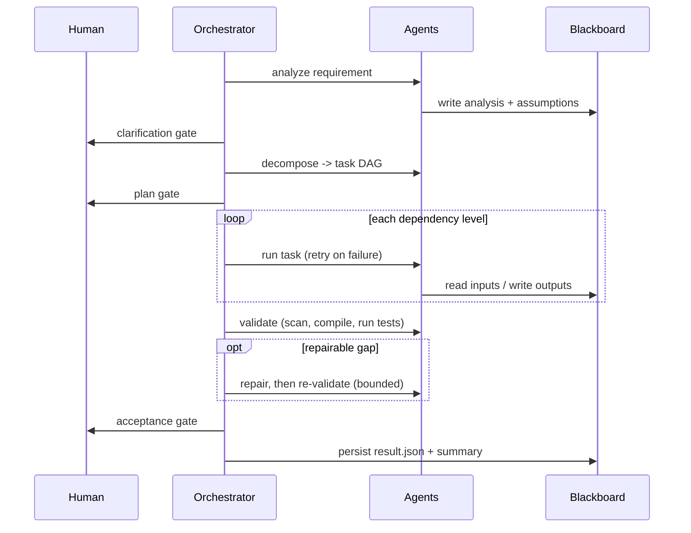

# Architecture Overview

## 1. Purpose

The Agentic SDLC system transforms a natural-language software requirement into a
**reviewable engineering outcome**: a normalized problem statement, a dependency-aware
plan, generated code + API contract + tests + docs, a validation report, and a final
engineering summary — produced under **controlled autonomy** (agents act, humans approve).

## 2. Component model



## 3. Execution model & control flow

The orchestrator runs three phases:

1. **Bootstrap** — `RequirementAnalyst` normalizes the requirement and records an
   explicit assumption for every ambiguity. A **clarification gate** lets a human review.
2. **Plan** — `TaskDecomposer` produces a DAG; a **plan gate** approves it. The DAG is
   grouped into *dependency levels* via topological sort, and independent work
   (e.g. `code` and `docs`) in the same level runs concurrently (a thread per task;
   `--sequential` disables it). A model-authored plan is checked (known categories, required
   stages, acyclic) and normalized so validation depends on the work it reports on.
3. **Execute & Accept** — the orchestrator walks the levels, dispatching each task to the
   agent registered for its `category`. Every task is wrapped in **retry-with-backoff**;
   a persistent failure **degrades** optional tasks (docs, impact) or **halts** on required
   ones. If validation finds a repairable gap (missing contract or docs), the **Repair**
   agent fixes it and validation re-runs (bounded). A final **acceptance gate** reviews
   the validation report; in auto mode a failing report is never accepted.



## 4. The DAG (mandatory URL-shortener example)

```
design ──┬─► code ──► tests ──┐
         │                    ├─► validate ──► summary
         └─► docs ────────────┘
```

Brownfield requirements inject an `impact` task that `code` depends on:

```
design, impact ──► code ──► tests ──┐
                    docs ───────────┴─► validate ──► summary
```

With `--repo`, the run is in **change mode**: the CodebaseAnalyst snapshots the repository
(read-only) onto the blackboard; the CodeGenerator asks the provider for a *change set*
(only new/changed files — code, tests or docs) instead of a project; the tests/docs agents
defer to it; the Validator lays the change over a throwaway copy of the repository and runs
the scan, compile, and the repository's own tests plus the new ones; the output is the
changed files plus `CHANGES.diff`, and the repository is never written.

## 5. Key technical decisions

| Decision | Rationale |
| --- | --- |
| **Perceive → decide → act agents** | Each agent observes state, chooses an action, and records *why* — the property that makes them agents, not functions; decisions are auditable. |
| **Validation feedback loop** | Repairable findings flow *back* into generation (bounded), so recovery is agent-driven self-correction, not linear retry. |
| **Blackboard coordination** | Agents never call each other; all state flows through one inspectable object, making runs auditable and agents independently testable. |
| **Provider seam** | A small typed interface (`ReasoningProvider`) lets the same agents run on a live LLM (primary) or offline (fallback) without changing orchestration. |
| **LLM-first, never LLM-dependent** | The model drives every stage including code generation; each stage falls back to the deterministic engine on error, so a run always completes and CI can test the whole pipeline without a key. |
| **Sandbox gate for model code** | Model-authored code is scanned, compiled and its own tests run before acceptance, with one repair pass fed by the real failure; then the verified template. |
| **Scan before execute** | The AST safety scan runs before any generated code is executed, in both the codegen gate and the Validator. |
| **Knowledge packs** | Domain expertise is isolated and pluggable; adding a domain is a new pack, not an orchestrator change. |
| **DAG by dependency level** | Real sequencing and concurrent execution of independent tasks, not linear execution. |
| **Retry / degrade / halt** | Concrete error handling and recovery with a clear required-vs-optional policy. |
| **Validator runs the tests** | Outputs are *verified* (compiled + executed), not merely produced. |
| **Sandboxed artifact writes** | Path-traversal guard is a real guardrail for safe execution. |
| **HITL gates** | Controlled autonomy: agents act; humans approve at defined checkpoints; the interactive gate fails closed. |

## 6. Extension points

- **New domain:** add a `KnowledgePack` and register it in `DeterministicProvider._PACKS`.
- **New capability/agent:** add an `Agent` and one entry in `agents.DAG_AGENTS`; add a task
  to the decomposer with the matching `category`.
- **Live model (primary):** set `--provider claude` (or `openai`); the model drives
  analysis, decomposition, design and code + test generation, with per-stage deterministic
  fallback and usage metrics (tokens, latency, cost, retries, fallbacks).
